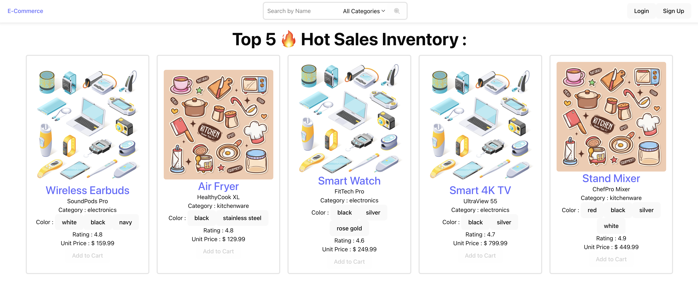
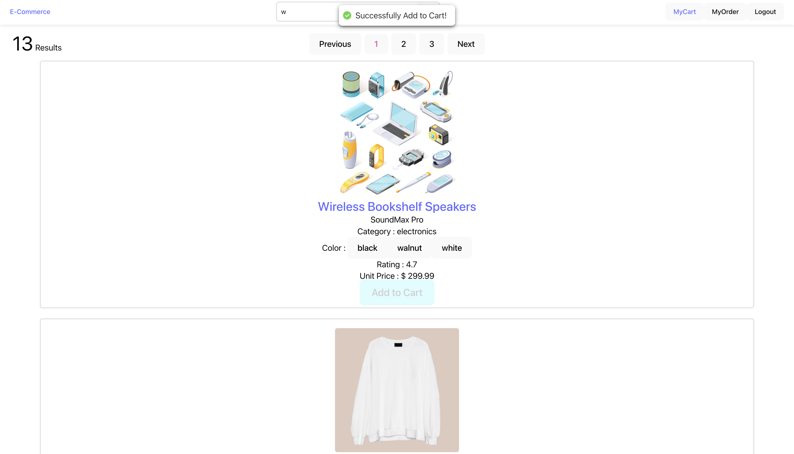
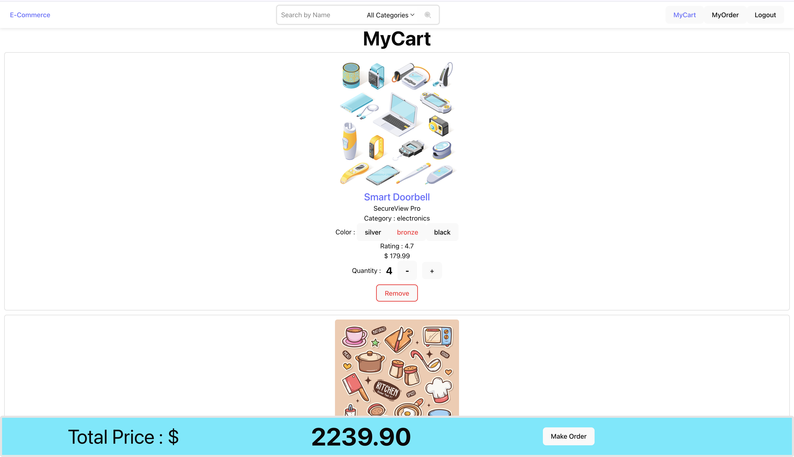
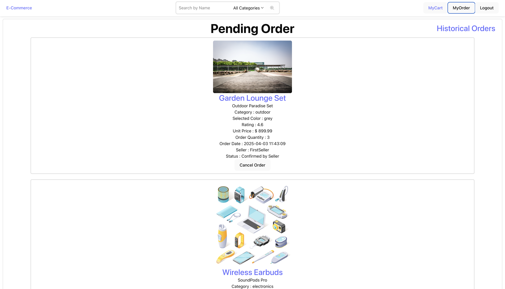
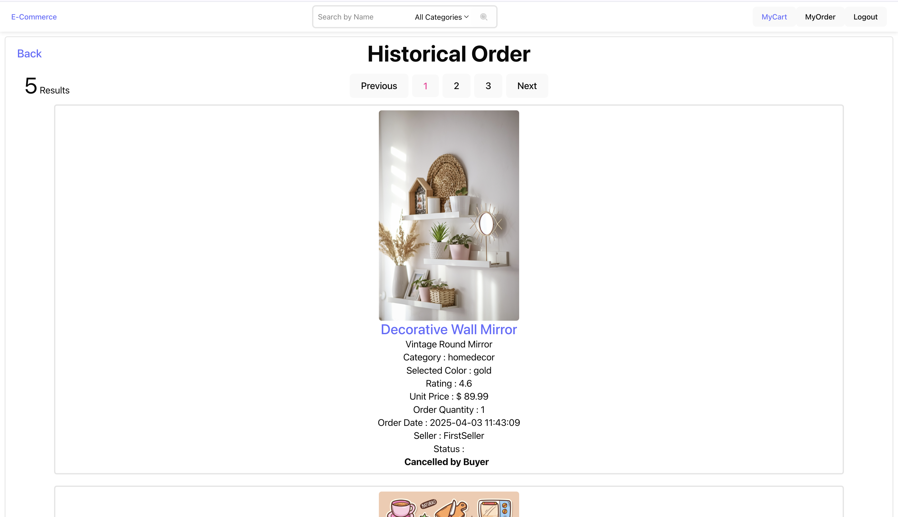
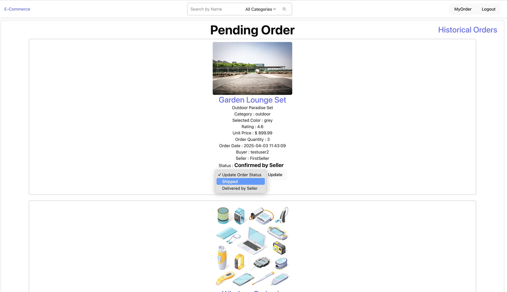
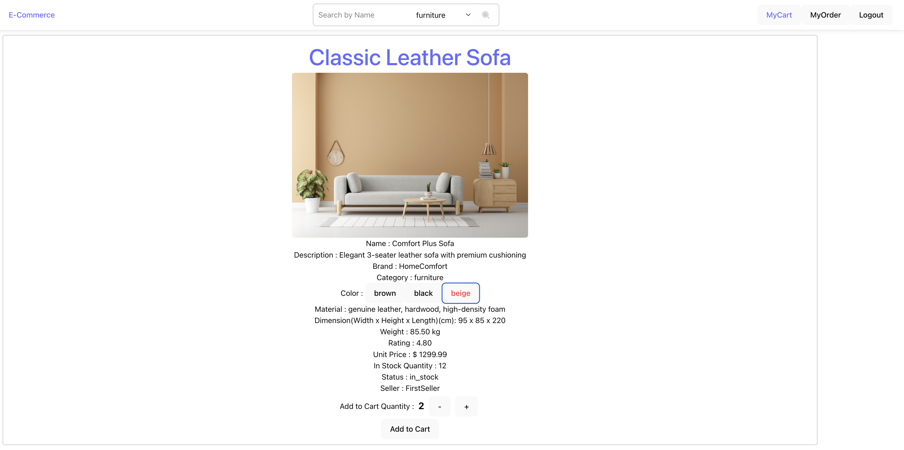

# e-Commerce Website

This is the demonstration of <b>e-Commerce Website Full Stack Web Application</b>

Video Demonstration : - 

## Table of Contents

- Background
- Tech Stack & Features
- Version
- Assumption
- Quick Start

## Background

This is a full stack web application demonstration built with React, TypeScript, Tailwind CSS, PostgreSQL, Django and so on. Buyer is able to add desired inventory to the cart and make order. Also, buyer is able to view the order's status. The seller is able to confirm and update the order status with the buyer.

### Main Page

### Inventory Search Page

### My Cart

### Pending Order

### Historical Order

### Seller's View

### Inventory Detail Page

Images source : FreePik, https://www.freepik.com/

## Tech Stack & Features

1. React
2. TypeScript
3. PostgreSQL
4. Tailwind CSS
5. JWT
6. Django

## Version

1. PostgreSQL - 17
2. TypeScript - 5.7.3
3. React - 19.0.0
4. Tailwind - 4.0
5. Django - 5.1.7

### Assumption

- The payment is made before order could be made successfully.

## Quick Start

Make sure you have the following installed on your machine:
- NodeJS
- npm (Node Package Manager)
- Python 
- Django
- PostgreSQL

### Cloning the Repository
 > git clone https://github.com/YeonTHY95/eCommerceWebsite.git
 > 
 > cd eCommerceWebsite

### Installation

Install the project dependencies for frontend using npm:

> cd frontend
>
> cd eCommerceWebsite
>
> npm install
>
> npm run dev

Then for backend using python:

> cd .. && cd ..
>
> cd backend
>
> python -m venv pythonvenv
>
> source pythonvenv/bin/activate
>
> python -m pip install -r requirements.txt

Make sure you modify Project's settings.py to accommodate your local Database configuration

### Seeding Database

To populate database with User Model and Inventory Model Info from file userseeding.json and inventoryseeding.json under folder fixtures

> python manage.py loaddata userseeding.json inventoryseeding.json

The seller's username is **FirstSeller** with password **test** (in plain text without encryption).

### Running the Project

> python manage.py runserver

Open http://localhost:5173/ in your browser to view the project. Make sure PostgreSQL is up and running

### Testing the DerScanner Push Event with Public IP Address ###

